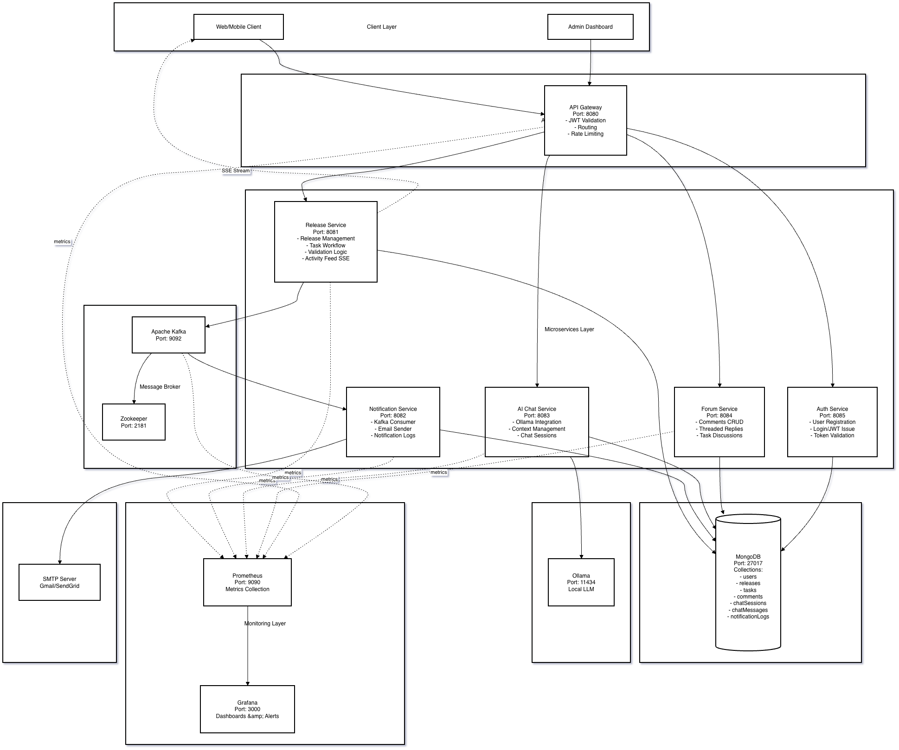
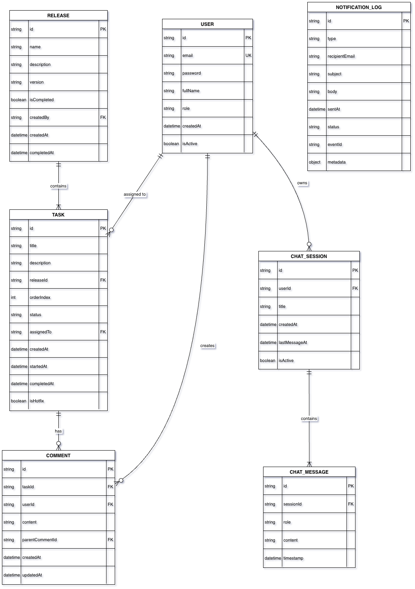

# OpsFlow - Real-Time Release Management System

A distributed microservices-based release management platform with event-driven architecture, real-time collaboration, and comprehensive monitoring.

## 🏗️ Architecture

The system consists of the following services:

- **API Gateway** (Port 8085) - Single entry point with API versioning (`/api/v1/`)
- **Auth Service** (Port 8082) - Authentication and user management
- **Release Service** (Port 8081) - Release and task workflow management
- **Notification Service** (Port 8083) - Event-driven notifications
- **Chatbot Service** (Port 8084) - AI-powered assistant using Ollama (llama3.2:1b)
- **Ollama** (Port 11434) - Local LLM inference server
- **MongoDB** (Port 27017) - Primary database
- **Kafka** (Port 9094) - Event streaming backbone
- **Kafka UI** (Port 8080) - Kafka management interface
- **Prometheus** (Port 9090) - Metrics collection
- **Grafana** (Port 3000) - Monitoring dashboards

## Architecture



## Entities



## 📋 Prerequisites

Before running the application, ensure you have the following installed:

- **Docker** (version 20.10 or higher)
- **Docker Compose** (version 2.0 or higher)
- **Git** (for cloning the repository)

Check your installations:

```bash
docker --version
docker compose version
```

## 🚀 Getting Started

### Step 1: Clone the Repository

```bash
git clone <repository-url>
cd OpsFlow
```

### Step 2: Create Environment File

Create a `.env` file in the root directory for environment-specific configurations:

```bash
cp .env.example .env
```

Update any necessary environment variables. This file is used by the docker compose.

### Step 3: Build the Services

Build all Docker images:

```bash
docker compose build
```

This will:

- Build Docker images for all microservices
- Download required base images (Java 21, MongoDB, Kafka, etc.)
- Compile and package Spring Boot applications

**Note:** First build may take 5-10 minutes depending on your internet connection.

### Step 4: Start the Services

Start all services in detached mode:

```bash
docker compose up -d
```

To view logs while starting:

```bash
docker compose up
```

### Step 5: Verify Services are Running

Check the status of all services:

```bash
docker compose ps
```

All services should show as "healthy" or "running". Services with health checks may take 30-60 seconds to become healthy.

View logs for a specific service:

```bash
docker compose logs -f <service-name>

# Examples:
docker compose logs -f api-gateway
docker compose logs -f auth-service
docker compose logs -f release-service
```

## 🌐 Accessing the Services

Once all services are running, you can access them at:

### Application Services

- **API Gateway**: http://localhost:8085
  - All API requests should go through this endpoint
  - Example: `http://localhost:8085/api/v1/auth/login`

### Health Checks

Check service health:

```bash
# API Gateway
curl http://localhost:8085/actuator/health

# Auth Service
curl http://localhost:8082/actuator/health

# Release Service
curl http://localhost:8081/actuator/health

# Notification Service
curl http://localhost:8083/actuator/health

# Chatbot Service
curl http://localhost:8084/actuator/health
```

## 🛠️ Development Commands

### Stop All Services

```bash
docker compose down
```

### Stop and Remove Volumes (Clean Reset)

```bash
docker compose down -v
```

**Warning:** This will delete all database data!

### Rebuild a Specific Service

```bash
docker compose build <service-name>
docker compose up -d <service-name>

# Example:
docker compose build api-gateway
docker compose up -d api-gateway
```

### View Service Logs

```bash
# Follow logs for all services
docker compose logs -f

# Follow logs for specific service
docker compose logs -f api-gateway

# View last 100 lines
docker compose logs --tail=100 release-service
```

### Restart a Service

```bash
docker compose restart <service-name>

# Example:
docker compose restart auth-service
```

## 📊 API Documentation

### Base URL

All API requests should use the API Gateway:

```
http://localhost:8085/api/v1
```

### Authentication Endpoints

```bash
# Register a new user
POST http://localhost:8085/api/v1/auth/register

# Login
POST http://localhost:8085/api/v1/auth/login
```

### Release Endpoints

```bash
# Get all releases
GET http://localhost:8085/api/v1/releases

# Create a release
POST http://localhost:8085/api/v1/releases

# Get release by ID
GET http://localhost:8085/api/v1/releases/{id}
```

### Chatbot Endpoints

```bash
# Create a new chat session
POST http://localhost:8085/api/v1/chat/session
Body: {
  "userId": "user-123",
  "releaseId": "release-456"  # Optional
}

# Send a message to the chatbot
POST http://localhost:8085/api/v1/chat/{sessionId}/message
Body: {
  "message": "What are the pending tasks?"
}

# Get chat history
GET http://localhost:8085/api/v1/chat/{sessionId}/history

# Get all user chat sessions
GET http://localhost:8085/api/v1/chat/sessions?userId={userId}
```

### MongoDB Interaction

```bash
# Connect to MongoDB container
docker exec -it mongodb mongosh

# Inside mongosh:
show dbs
use flow_ops_db
show collections
```
